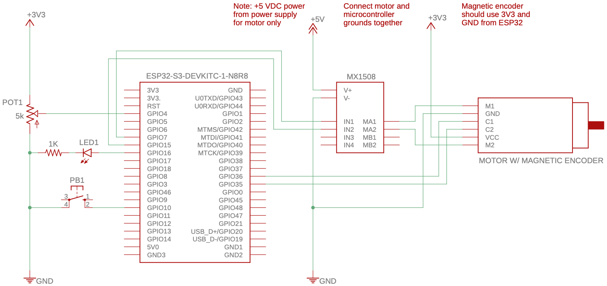
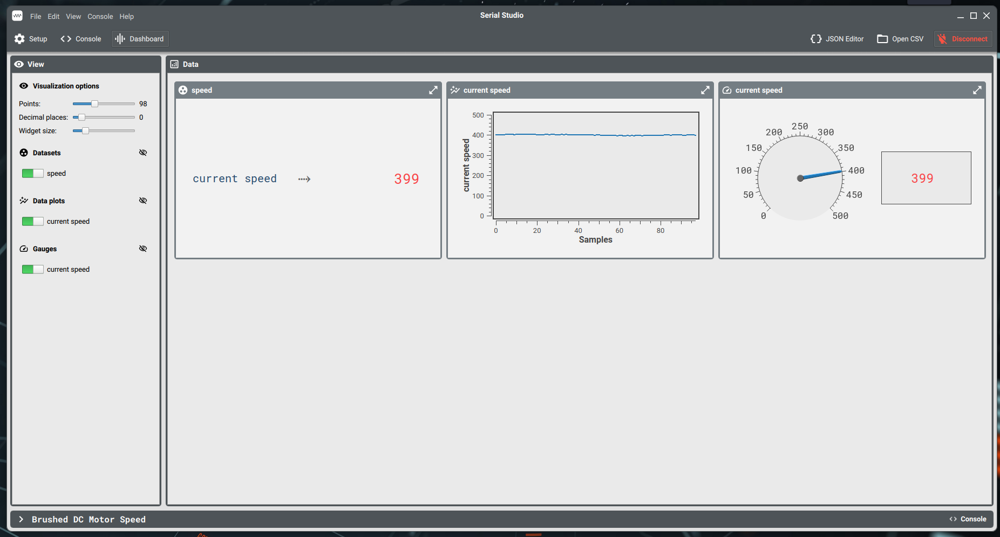

| Supported Targets | ESP32 | ESP32-C6 | ESP32-S3 |
| ----------------- | ----- | -------- | -------- |
# Lab 1 

Based on the Espressif MCPWM Brushed DC Motor Example (https://github.com/espressif/esp-idf/tree/master/examples/peripherals/mcpwm/mcpwm_bdc_speed_control)

(See the README.md file in the upper level 'examples' directory for more information about examples.)

This example mainly illustrates how to drive a brushed DC motor by generating two specific PWM signals. However the PWM signals from ESP chip can't drive motors directly as the motor usually consumes high current. So an H-bridge such as the [MX1508](https://components101.com/modules/mx1508-dc-motor-driver-pinout-features-datasheet) should be used to provide the needed voltage and current for the brushed DC motor. To simplify the DC motor control of MCPWM peripheral driver, there's a component called [bdc_motor](https://components.espressif.com/component/espressif/bdc_motor). which abstracts the common operations into a generic interface. The most useful operations are: `forward`, `reverse`, `coast` and `brake`.

To measure the speed of motor, a magnetic encoder is used to generate the "speed feedback" signals (e.g. a pair of quadrature signals). In the example, we use the PCNT peripheral to decode that quadrature signals. For more information, please refer to [rotary encoder example](../../pcnt/rotary_encoder/README.md) as well.

The example uses a simple PID algorithm to keep the motor spin in a stable speed. Like the [bdc_motor](https://components.espressif.com/component/espressif/bdc_motor), the [PID component](https://components.espressif.com/component/espressif/pid_ctrl) is also managed by the component manager. These components' dependencies are listed in the [manifest file](main/idf_component.yml).

## How to Use Example

Before project configuration and build, be sure to set the correct chip target using `idf.py set-target esp32-s3`.

### Hardware Required

* An ESP32-S3-DevKitC-1 development board
* A USB cable for microcontroller power supply and programming
* A separate 5-6 V power supply for the brushed DC motor and H-bridge
* MX1508 dual DC motor driver board to transfer PWM signal into driving signal
* A brushed DC gearmotor with integrated magnetic quadrature encoder to detect speed
* A solderless breadboard
* Jumper or Dupont wires (M/M, M/F) to connect components

Additional hardware used for lab exercise:

* Red LED
* 1k 1/4 W resistor
* 5k potentiometer
* SPST-NO pushbutton

Schematic:


### Build and Flash

Run `idf.py -p PORT flash monitor` to build, flash and monitor the project.

(To exit the serial monitor, type ``Ctrl-]``.)

See the [Getting Started Guide](https://idf.espressif.com/) for full steps to configure and use ESP-IDF to build projects.


## Example Output

Run the example, you will see the following output log:

```
I (0) cpu_start: Starting scheduler on APP CPU.
I (308) lab1: Create DC motor
I (308) gpio: GPIO[7]| InputEn: 0| OutputEn: 1| OpenDrain: 0| Pullup: 1| Pulldown: 0| Intr:0
I (318) gpio: GPIO[15]| InputEn: 0| OutputEn: 1| OpenDrain: 0| Pullup: 1| Pulldown: 0| Intr:0
I (328) lab1: Init pcnt driver to decode rotary signal
I (328) gpio: GPIO[36]| InputEn: 1| OutputEn: 0| OpenDrain: 0| Pullup: 1| Pulldown: 0| Intr:0
I (338) gpio: GPIO[35]| InputEn: 1| OutputEn: 0| OpenDrain: 0| Pullup: 1| Pulldown: 0| Intr:0
I (348) gpio: GPIO[35]| InputEn: 1| OutputEn: 0| OpenDrain: 0| Pullup: 1| Pulldown: 0| Intr:0
I (358) gpio: GPIO[36]| InputEn: 1| OutputEn: 0| OpenDrain: 0| Pullup: 1| Pulldown: 0| Intr:0
I (368) lab1: Create PID control block
I (378) lab1: Create a timer to do PID calculation periodically
I (378) lab1: Enable motor
I (388) lab1: Forward motor
I (388) lab1: Start motor speed loop
```

### View velocity curve in [Serial Studio](https://github.com/Serial-Studio/Serial-Studio)

To help tune the PID parameters (i.e. `Kp`, `Ki` and `Kd` in the example), this example supports to log a short string frame of runtime motor speed. The string frame can be parsed by [Serial Studio](https://github.com/Serial-Studio/Serial-Studio). This example also provides the [communication description file](serial-studio-dashboard.json) out of the box, which can be loaded by Serial Studio and then plot the curves as follows:



## Troubleshooting

* Make sure your ESP board and H-bridge module have been connected to the same GND panel.
* The default PID parameters set in the example might not work well for all motors, because it's not adaptive. You may need to fine tune the parameters.

## Exercise

Modify the example code to add the following functionality:

1. The pushbutton connected to GPIO10 should reverse the motor direction each time that it is pressed. Generic GPIO setup is introduced in this [example](https://github.com/espressif/esp-idf/tree/master/examples/peripherals/gpio/generic_gpio). Use an interrupt-based software switch debounce to prevent false triggers, similar to the code found [here](https://github.com/MME9654/Debounce-example) 
2. The LED connected to GPIO15 should illuminate solid when the motor is rotating in the forward direction and blink on and off every 300 milliseconds when the motor is rotating in the reverse direction. 
3. The potentiometer connected to GPIO4 (AD1_3) should control the motor speed from 0 to the maximum rpm (75 rpm @ 6 VDC). A [one-shot ADC](https://github.com/espressif/esp-idf/tree/master/examples/peripherals/adc/oneshot_read) can be used for this purpose. For improved stability, 20 samples should be measured and then averaged. Use a map function to scale the sampled ADC value to encoder counts. 
```
long Map(long x, long in_min, long in_max, long out_min, long out_max)
{
    return (x - in_min)* (out_max - out_min) / (in_max - in_min) + out_min;
}
```

4. Output the speed error to Serial Studio and create a new bar/level widget to plot the error. Observe how the motor speed and error are affected by changes in direction and motor speed.

### Other things to explore

1. Add a second pushbutton to start and stop the motor. The LED pattern could also be updated to reflect the stopped condition. Can the motor direction be changed while stopped? Does the LED clearly indicate 4 conditions (rotating forward, rotating backward, stopped ready to rotate forward, stopped ready to rotate backward)? While a second LED could be added for this purpose, different blink patterns and/or brightnesses should be sufficient.
2. With the help of Serial Studio, explore different PID gains. Some tips for setting the gains may be found [here] (https://pidexplained.com/how-to-tune-a-pid-controller/).